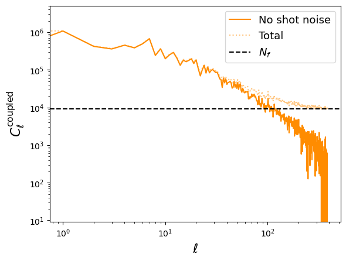
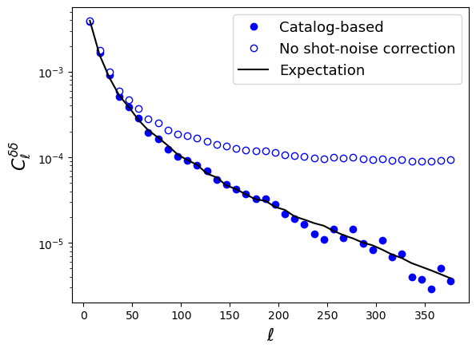

Example 12: Source clustering power spectra
===========================================

This sample script showcases the use of the NmtFieldCatalog class for source clustering.

.. literalinclude:: ../../test/sample_clusteringcatalog.py
   :language: python

The result of running this is:

