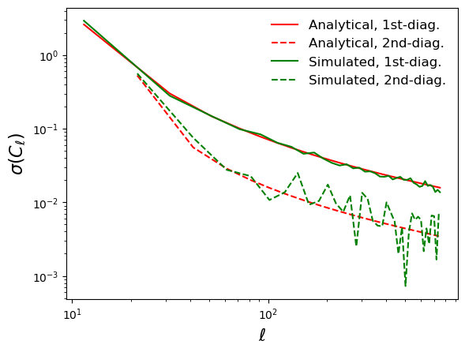

Example 8: Computing covariance matrices
========================================

This sample script showcases the ability of NaMaster to estimate the Gaussian covariance matrix for the pseudo-Cl estimator.

.. literalinclude:: ../../test/sample_covariance.py
   :language: python

After running this script, you should see the following result:

