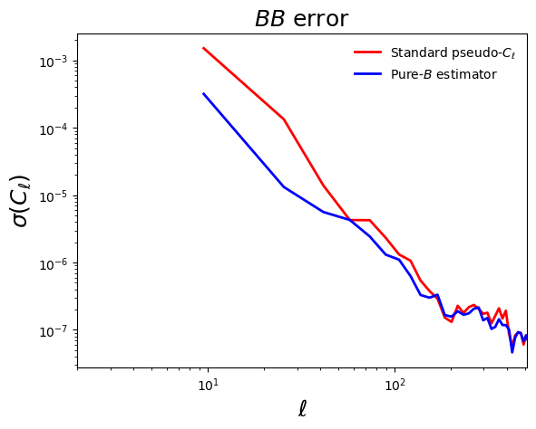

Example 6: Pure E and B
=======================

This sample script showcases the computation of power spectra using the pure-E and B approach.

.. warning::
   If you have HEALPix UNSEEN values in your map, set those pixels to zero in both the mask and map in order to use B-mode purification.

.. literalinclude:: ../../test/sample_pureB.py
   :language: python

After running this script, you should see the following result:

