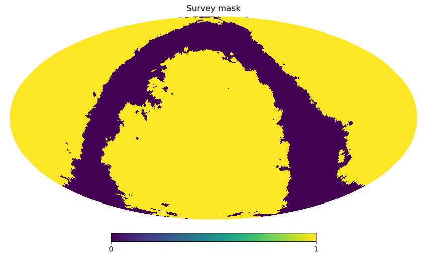
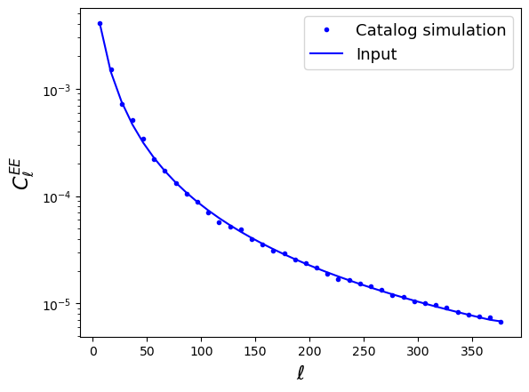

Example 11: Catalog-based power spectra for spin-s fields
=========================================================

This sample script showcases the use of the NmtFieldCatalog class for spin-2 source catalogs.

.. literalinclude:: ../../test/sample_shearcatalog.py
   :language: python

The result of running this is:

