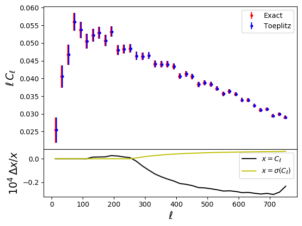

Example 10: The Toeplitz approximation
======================================

This sample script shows how to compute mode-coupling coefficients fast using the Toeplitz approximation of `Louis et al. 2020 <https://arxiv.org/abs/2010.14344>`_

.. literalinclude:: ../../test/sample_toeplitz.py
   :language: python

The result of running this is:

