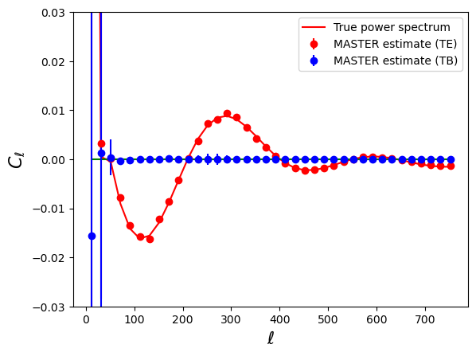

Example 5: Using workspaces
===========================

This sample script showcases the use of the NmtWorkspace class to speed up the computation of multiple power spectra with the same mask. This is the most general example in this suite, showing also the correct way to compare the results of the MASTER estimator with the theory power spectrum.

.. literalinclude:: ../../test/sample_workspaces.py
   :language: python

After running this script, you should see the following result:

